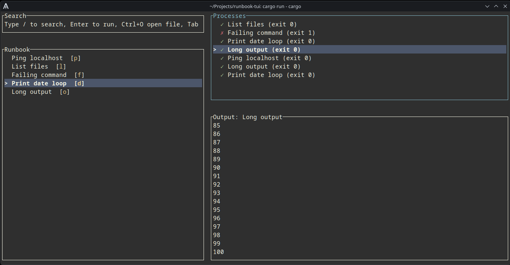
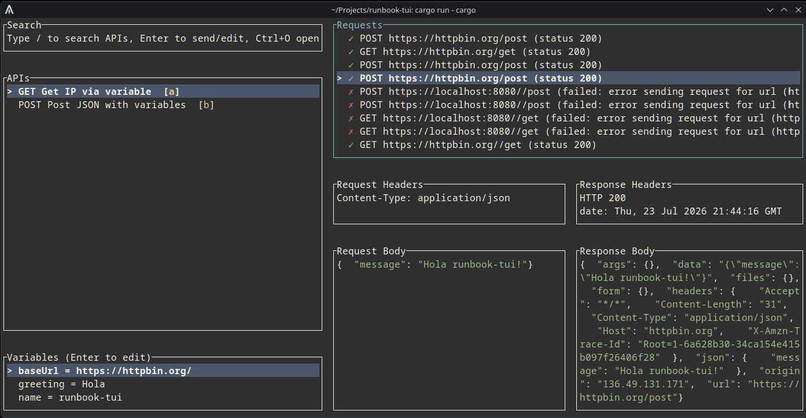

# runbook-tui

A terminal user interface for running commands and HTTP requests from structured configuration files.

`runbook-tui` can operate in two modes:

- **Runbook mode**: Load a TOML file of shell commands and run them interactively.
- **API mode**: Load a Postman collection or an OpenAPI 3.x spec (JSON or YAML) and send HTTP requests interactively.

It is built with [ratatui](https://github.com/ratatui/ratatui) and [tokio](https://tokio.rs/) for an async, keyboard-driven terminal experience.

## Screenshots

### Runbook mode


### API mode


## Features

- Two-pane layout: list on the left, history/output on the right.
- Keyboard-driven navigation with `Tab`, arrow keys, `Ctrl+N`/`Ctrl+P`, `PgUp`/`PgDn`, `Home`/`End`.
- Live command output with automatic log following.
- Search/filter the command or API list with `/`.
- Per-command keybindings and per-API auto-assigned letter keys.
- Built-in help overlay (`?`).
- File import dialog (`Ctrl+O`) for switching runbooks or API collections without leaving the TUI.
- Multiple tabs: open several runbooks or API collections at once, switch with `F2`, and open new tabs with `F3`.
- In API mode, request and response bodies are pretty-printed and colorized based on `Content-Type` (`application/json`, `application/xml`, `text/html`).
- Panic-safe terminal restoration via a RAII `TerminalGuard` and a custom panic hook.

## Installation

Requires a Rust toolchain (https://rustup.rs/):

```bash
cargo build --release
```

The binary is written to `target/release/rbt`.

Prebuilt binaries for Linux, macOS, and Windows are attached to GitHub Releases. They are built automatically by `.github/workflows/build.yml`.

## Usage

```bash
rbt --version
```

### Runbook mode

Create a TOML file named `runbook.toml` (or pass any `.toml` file):

```toml
[[commands]]
title = "Ping localhost"
keybinding = "p"
command = "ping -c 3 127.0.0.1"

[[commands]]
title = "List files"
keybinding = "l"
command = "ls -la"

[[commands]]
title = "Failing command"
keybinding = "f"
command = "false"

[[commands]]
title = "Print date loop"
keybinding = "d"
command = "for i in 1 2 3 4 5; do date; sleep 1; done"
```

Run it:

```bash
./target/release/rbt
# or with an explicit path:
./target/release/rbt /path/to/runbook.toml
# multiple files open as tabs:
./target/release/rbt runbook1.toml runbook2.toml
```

### API mode

Create or export a Postman collection as JSON, or write an OpenAPI 3.x spec in JSON or YAML. Postman files must contain an `item` array with `request` objects. OpenAPI files must contain `openapi` and `paths`:

```json
{
  "info": { "name": "Test Collection" },
  "item": [
    {
      "name": "Get IP",
      "request": {
        "method": "GET",
        "url": "https://httpbin.org/get",
        "header": []
      }
    },
    {
      "name": "Post JSON",
      "request": {
        "method": "POST",
        "url": "https://httpbin.org/post",
        "header": [
          { "key": "Content-Type", "value": "application/json" }
        ],
        "body": {
          "mode": "raw",
          "raw": "{\"hello\":\"world\"}"
        }
      }
    }
  ]
}
```

Run it with `--api`:

```bash
./target/release/rbt --api test_collection.json
```

OpenAPI specs work the same way, including `.yaml` and `.yml` files:

```bash
./target/release/rbt --api test_openapi.yaml
```

Multiple collections or runbooks can be opened as tabs:

```bash
./target/release/rbt --api test_collection.json runbook.toml
./target/release/rbt runbook1.toml runbook2.toml
```

### Variables in API collections

Variables defined at the collection level are substituted in the `url`, header `value`, and request `body` before a request is sent. Use the `{{variable_name}}` syntax. In API mode the lower-left Variables pane shows the current values; press `Tab` to focus it and `Enter` on a variable to edit its value for the current session.

Postman variables with `"type": "secret"` are masked. OpenAPI `securitySchemes` with `type: apiKey` are also treated as secrets, so their values are masked and can be edited in the Variables pane.

Variables with secret values are masked as `********` in the variables pane. When editing a secret variable the value is also hidden; press `m` while editing to toggle the mask off and on.

```json
{
  "info": { "name": "Variables Test" },
  "variable": [
    { "key": "baseUrl", "value": "https://httpbin.org", "type": "string" },
    { "key": "greeting", "value": "Hello", "type": "string" },
    { "key": "name", "value": "runbook-tui", "type": "string" }
  ],
  "item": [
    {
      "name": "Post with variables",
      "request": {
        "method": "POST",
        "url": "{{baseUrl}}/post",
        "header": [
          { "key": "Content-Type", "value": "application/json" }
        ],
        "body": {
          "mode": "raw",
          "raw": "{\"message\":\"{{greeting}} {{name}}!\"}"
        }
      }
    }
  ]
}
```

Run it with `--api`:

```bash
./target/release/rbt --api test_collection_variables.json
```

### Environment variable groups

API collections can define default variables, and you can overlay environment-specific values from a separate JSON file. This makes it easy to switch between `dev`, `staging`, `prod`, or any other environment without editing the collection.

Create a file like `environments.json`:

```json
{
  "environments": {
    "dev": {
      "baseUrl": "http://localhost:8080",
      "greeting": "Hi",
      "apiKey": {
        "value": "dev-secret",
        "type": "secret"
      }
    },
    "prod": {
      "baseUrl": "https://api.example.com",
      "greeting": "Hello"
    }
  }
}
```

Each environment is an object of `key: value` pairs. Values override collection variables with the same key and can add new keys. A value can also be an object with `value` and `type`; set `type` to `secret` to have the value masked in the variables pane. Load the group and select an environment at startup:

```bash
./target/release/rbt --api test_collection_variables.json --env environments.json --environment prod
```

You can also switch environments at runtime by pressing `Ctrl+G` in API mode. The environment menu shows:

- `collection` (the collection's own variables)
- each environment from any loaded env group file
- `Import env group...` to load another env group JSON file without restarting
- `[ ] env overlay` / `[x] env overlay` when matching shell environment variables exist

The env overlay applies your current shell environment variables on top of whichever environment is selected. Matching supports the variable name, its uppercase form, and its `SCREAMING_SNAKE_CASE` form (so `baseUrl` matches `baseUrl`, `BASEURL`, or `BASE_URL`). Use the overlay to inject secrets or per-run values without editing files.

### Color themes

Press `Ctrl+T` to cycle through the built-in themes. The current theme is saved to `~/.config/runbook-tui/theme.toml` and restored on the next startup.

Included themes:

- Default
- Catppuccin Mocha
- Catppuccin Latte
- Base16 Default Dark
- Base16 Default Light
- Base16 Ocean Dark
- Base16 Ocean Light
- Base16 Monokai
- Base16 One Dark
- Base16 One Light

### Language / Locale

`rbt` is internationalized using [rust-i18n](https://github.com/longbridge/rust-i18n). The following locales are built in:

- `en` (default fallback)
- `fr`
- `de`
- `es`
- `it`
- `ko`
- `zh` (Simplified Chinese)

Set the `RUST_I18N_LOCALE` environment variable when launching `rbt` to use a different language:

```bash
RUST_I18N_LOCALE=fr ./target/release/rbt
```

You can also export the variable for your shell session:

```bash
export RUST_I18N_LOCALE=ko
./target/release/rbt
```

If the requested locale is not available, the UI falls back to English. To change the locale programmatically, call `rust_i18n::set_locale("fr")` before the UI loop starts.

### Exporting output

Press `Ctrl+E` to export the output of the currently selected process or API request to a text file in the current directory.

- **Runbook mode**: the file contains the command and its full output.
- **API mode**: the file contains the formatted request (`METHOD URL`, headers, body) and the full response (status, headers, body).

Exported files are named `rbt-export-runbook-<timestamp>.txt` or `rbt-export-api-<timestamp>.txt`.

## Keybindings

### Global

| Key | Action |
| --- | --- |
| `?` | Toggle help overlay |
| `Tab` | Cycle focus forward |
| `Shift+Tab` | Cycle focus backward |
| `m` | Maximize / restore the focused pane |
| `Ctrl+E` | Export selected output to a file |
| `Ctrl+G` | Switch API environment (API mode only) |
| `Ctrl+O` | Open the file import dialog |
| `F2` | Switch to the next tab, or open the tab selector when more than two tabs |
| `Ctrl+Left` / `Ctrl+Right` | Move to the previous / next tab |
| `F3` | Open the file import dialog in a new tab |
| `F4` | Edit the current tab's source file in an external editor |
| `Ctrl+T` | Cycle color theme |
| `Ctrl+C` | Quit |
| `Ctrl+N` | Move down / next |
| `Ctrl+P` | Move up / previous |

### Runbook mode

| Pane | Key | Action |
| --- | --- | --- |
| Commands | `↑`/`↓` or `Ctrl+P`/`Ctrl+N` | Select command |
| Commands | `Enter` | Run selected command |
| Commands | `/` | Search commands |
| Commands | `Esc` | Clear search |
| Commands | letter key | Run command by its keybinding |
| Processes | `↑`/`↓` or `Ctrl+P`/`Ctrl+N` | Select process |
| Processes | `PgUp`/`PgDn`/`Home`/`End` | Scroll output |
| Processes | `Esc`/`q` | Back to commands |
| Output | `↑`/`↓` or `Ctrl+P`/`Ctrl+N` | Scroll output |
| Output | `PgUp`/`PgDn`/`Home`/`End` | Scroll output |
| Output | `Esc`/`q` | Back to processes |

### API mode

| Pane | Key | Action |
| --- | --- | --- |
| APIs | `↑`/`↓` or `Ctrl+P`/`Ctrl+N` | Select API |
| APIs | `Enter` | Send selected request |
| APIs | `/` | Search APIs |
| APIs | `Esc` | Clear search |
| APIs | letter key | Send API by its auto-assigned key |
| Variables | `↑`/`↓` or `Ctrl+P`/`Ctrl+N` | Select variable |
| Variables | `Enter` | Edit selected value |
| Variables | `Esc` | Cancel edit |
| Requests | `↑`/`↓` or `Ctrl+P`/`Ctrl+N` | Select request |
| Requests | `PgUp`/`PgDn`/`Home`/`End` | Scroll response body |
| Requests | `Esc`/`q` | Back to APIs |
| Request Body | `↑`/`↓` or `Ctrl+P`/`Ctrl+N` | Scroll request body |
| Request Body | `PgUp`/`PgDn`/`Home`/`End` | Scroll request body |
| Request Body | `Esc`/`q` | Back to requests |
| Response Body | `↑`/`↓` or `Ctrl+P`/`Ctrl+N` | Scroll response body |
| Response Body | `PgUp`/`PgDn`/`Home`/`End` | Scroll response body |
| Response Body | `Esc`/`q` | Back to requests |

### File import dialog

| Key | Action |
| --- | --- |
| Type characters | Filter the file list |
| `↑`/`↓` or `Ctrl+P`/`Ctrl+N` | Select entry |
| `Enter` | Open directory or import file |
| `Esc` or `Ctrl+O` | Close dialog |

## Configuration

### Keybinding format

Runbook `keybinding` values support:

- Single letters or digits (`a`, `1`)
- Function keys (`f1` through `f12`)
- Control combinations (`ctrl+c`, `^c`)

### External editor

Press `F4` to edit the current tab's source file in an external editor. The editor is resolved in this order:

1. An `editor` field in the loaded runbook TOML file.
2. An `editor` field in `~/.config/runbook-tui/config.toml`.
3. The `VISUAL` environment variable.
4. The `EDITOR` environment variable.
5. `vim` as a fallback.
6. `vi` as a fallback.
7. `emacs` as a final fallback.

The `editor` value is executed through the shell, so it can include arguments. The file path is appended as the last argument and is safely quoted by `rbt`.

Runbook-local editor in `runbook.toml`:

```toml
editor = "vim"

[[commands]]
title = "Ping localhost"
keybinding = "p"
command = "ping -c 3 127.0.0.1"
```

Global editor in `~/.config/runbook-tui/config.toml`:

```toml
editor = "code -w"
```

Other examples:

- `editor = "subl -n"` — open in Sublime Text in a new window.
- `editor = "nvim"` — open in Neovim.
- `editor = "kitty -- nvim"` — open in a new Kitty terminal running Neovim.
- `editor = "'/Applications/Visual Studio Code.app/Contents/MacOS/Electron' -n"` — open a macOS `.app` bundle executable (quote the path because it contains spaces). Use a wait flag if the editor has one, otherwise `rbt` resumes immediately.

If the configured `editor` resolves to a directory (for example, an `.app` bundle path without the inner executable), `rbt` shows an error. Point `editor` at the actual executable inside the bundle.

### API collection notes

- Postman: only `request` objects with a `method` and `url` are imported.
- Postman: `header` entries are included in the outgoing request.
- Postman: only `body.mode == "raw"` is supported.
- OpenAPI: paths and operations (`get`, `post`, etc.) are imported, including path/query/header parameters.
- OpenAPI: `securitySchemes` with `type: apiKey` produce a secret variable and the appropriate header or query param.
- OpenAPI: request body examples and schema-derived examples are supported for `application/json` and other content types.
- `.json`, `.yaml`, and `.yml` files passed without `--api` are automatically treated as API collections if they parse as Postman or OpenAPI.

## Development

Build and run with cargo:

```bash
cargo run
cargo run -- --api test_collection.json
cargo clippy -- -D warnings
```

## Project structure

```text
src/
├── main.rs        # 6-line binary entry point
├── lib.rs         # Startup orchestration and module declarations
├── app.rs         # Application state, event handling, and command/API dispatch
├── ui.rs          # Rendering, layout, and terminal guard
├── theme.rs       # Centralized color/style theme
├── config.rs      # Runbook TOML parsing
├── keybinding.rs  # Keybinding parsing and matching
├── process.rs     # Async shell command runner
└── api.rs         # Postman / OpenAPI collection parsing and async HTTP client
```

## License

This project is provided as-is for local development and workflow automation.
